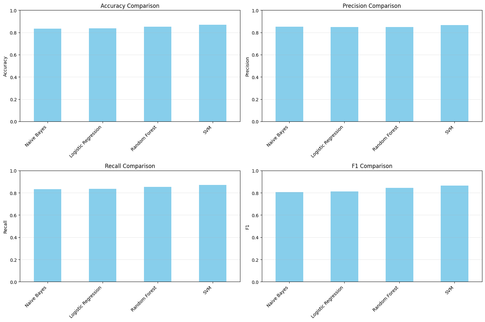
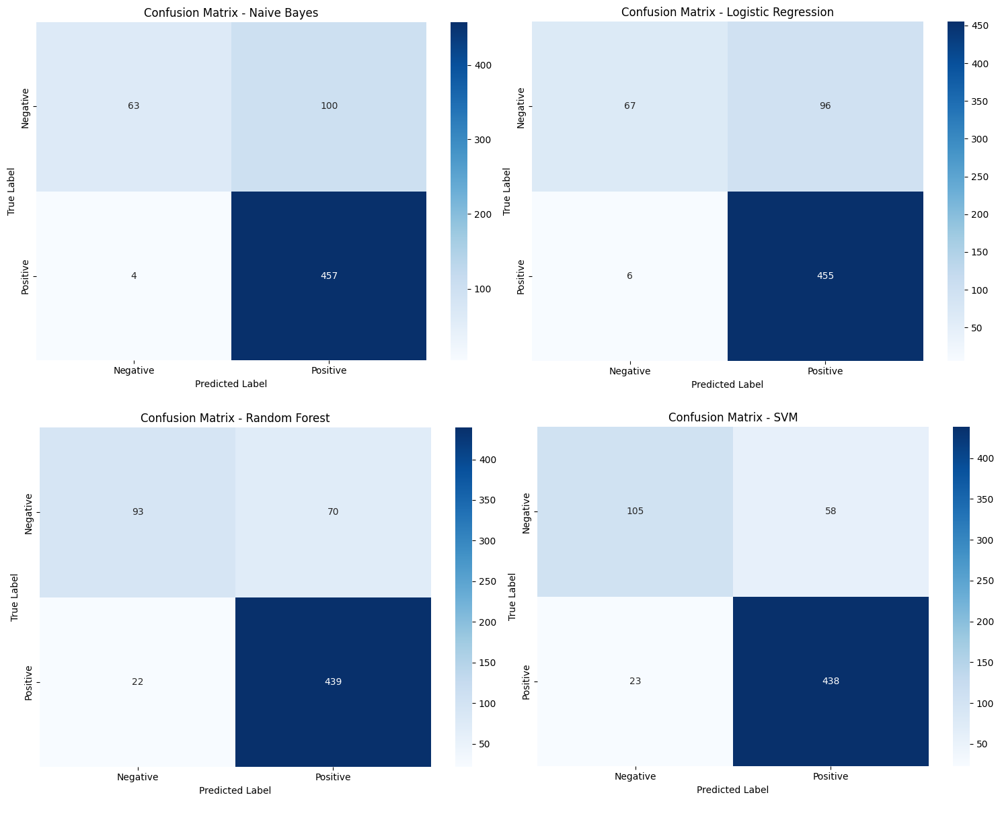
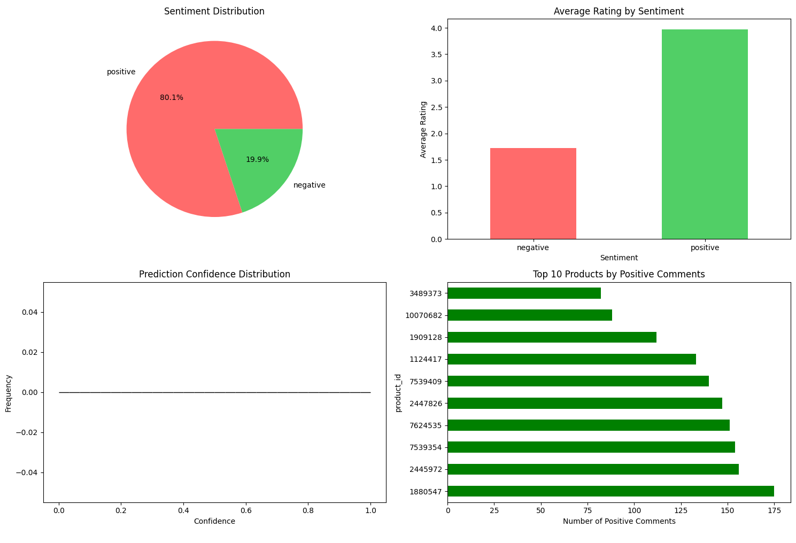

# Digikala Sentiment Analysis - Unsupervised Learning Project

## 📊 Project Overview

This notebook implements a comprehensive sentiment analysis pipeline for Samsung phone products using the Digikala (Iranian e-commerce platform) comments and products dataset. The project leverages unsupervised learning techniques combined with supervised classification models to analyze customer sentiment toward Samsung phones.

### Key Features
- **Data Processing**: Persian text preprocessing with Hazm (Persian NLP library)
- **Sentiment Classification**: Multi-model comparison (Naive Bayes, Logistic Regression, Random Forest, SVM)
- **Model Evaluation**: Comprehensive metrics and visualization
- **Sentiment Analysis**: Automated labeling of positive/negative sentiments
- **Visualization**: Interactive charts and graphs for data insights

---

## 📋 Dataset Information

The dataset consists of two main files:
- **Products Data**: 1,283,496 products with categories, prices, ratings, and brand information
- **Comments Data**: 6,156,289 user comments with ratings, recommendations, and review text

### Focus Area
- **Target Products**: Samsung Galaxy series phones (1843 unique products)
- **Total Comments Analyzed**: 4,136 Samsung-specific comments

---

## 🛠️ Installation & Requirements

```bash
# Install required packages
pip install hazm wordcloud seaborn scikit-learn
```

### Dependencies
- Python 3.11+
- Pandas, NumPy
- Scikit-learn
- Hazm (Persian NLP)
- Matplotlib, Seaborn
- WordCloud

---

## 📁 Project Structure

```
digikala-4-unsupervised-complete.ipynb
├── 1. Data Loading
│   ├── Load products dataset
│   ├── Load comments dataset
│   └── Filter Samsung products
├── 2. Data Preprocessing
│   ├── Persian text cleaning
│   ├── Tokenization & stopword removal
│   └── Sentiment labeling
├── 3. Feature Engineering
│   └── TF-IDF Vectorization
├── 4. Model Training
│   ├── Naive Bayes
│   ├── Logistic Regression
│   ├── Random Forest
│   └── SVM (Best Performing)
├── 5. Model Evaluation
│   ├── Accuracy & F1-Score comparison
│   └── Confusion matrices
└── 6. Analysis & Visualization
    ├── Sentiment distribution
    ├── Rating correlation
    └── Product comparison
```

---

## 🏆 Model Performance Comparison

| Model | Accuracy | Precision | Recall | F1-Score |
|-------|----------|-----------|--------|----------|
| Naive Bayes | 83.33% | 85.18% | 83.33% | 80.64% |
| Logistic Regression | 83.65% | 84.98% | 83.65% | 81.26% |
| Random Forest | 85.26% | 84.84% | 85.26% | 84.35% |
| **SVM** | **87.02%** | **86.67%** | **87.02%** | **86.48%** |

### 📊 Model Performance Visualization

**Screenshot 1: Model Performance Comparison**


### 📈 Confusion Matrices

**Screenshot 2: Confusion Matrices**


---

## 📊 Sentiment Analysis Results

### Sentiment Distribution

**Screenshot 3: Sentiment Distribution**


### Key Findings
- **Positive Sentiment**: 80.1% (3,313 comments)
- **Negative Sentiment**: 19.9% (823 comments)
- **Average Rating**: 3.52/5
- **Samsung Phone Price Range**: 172,500 - 568,890,000 Toman

### Top Products Analysis


---

## 💻 Key Code Examples

### Text Preprocessing
```python
def preprocess_persian_text(text):
    normalizer = Normalizer()
    text = normalizer.normalize(text)
    text = re.sub(r'[a-zA-Z0-9]+', '', text)
    text = re.sub(r'[^\w\s]', ' ', text)
    return ' '.join(text.split())

def remove_stopwords(text):
    persian_stopwords = set(stopwords_list())
    tokens = word_tokenize(text)
    filtered_tokens = [word for word in tokens 
                      if word not in persian_stopwords and len(word) > 1]
    return ' '.join(filtered_tokens)
```

### Model Training
```python
models = {
    'Naive Bayes': MultinomialNB(),
    'Logistic Regression': LogisticRegression(max_iter=1000),
    'Random Forest': RandomForestClassifier(n_estimators=100),
    'SVM': SVC(kernel='linear')
}

for name, model in models.items():
    model.fit(X_train_vec, y_train)
    y_pred = model.predict(X_test_vec)
    # Evaluate performance
```

---

## 🎯 How to Run the Notebook

1. **Set up environment**
   ```bash
   pip install -r requirements.txt
   ```

2. **Download dataset**
  https://www.kaggle.com/datasets/radeai/digikala-comments-and-products

3. **Run the notebook**
   ```bash
   jupyter notebook digikala-4-unsupervised-complete.ipynb
   ```

4. **Execute cells in order**
   - Follow the numbered sections
   - Allow time for model training (varies based on compute)

---

## 🧪 Testing New Comments

```python
def predict_sentiment(text, model=best_model, vectorizer=vectorizer):
    cleaned = preprocess_persian_text(text)
    processed = remove_stopwords(cleaned)
    vectorized = vectorizer.transform([processed])
    prediction = model.predict(vectorized)[0]
    return prediction, confidence

# Test example
comment = "این گوشی واقعا عالیه و خیلی راضی هستم از خریدم"
sentiment, confidence = predict_sentiment(comment)
print(f"Sentiment: {sentiment}")
```

---

## 📈 Visualizations Included

### What to Screenshot:

1. **Model Performance Comparison** (Bar Charts)
   - Accuracy, Precision, Recall, F1-Score for all 4 models
   - Position: After the model evaluation table

2. **Confusion Matrices** (Heatmaps)
   - 2x2 grid showing classification results
   - Position: After model performance charts

3. **Sentiment Distribution** (Pie Chart + Histogram)
   - Positive/Negative proportion
   - Confidence score distribution
   - Position: After sentiment analysis section

4. **Product Analysis** (Bar Charts)
   - Top 10 products by positive comments
   - Sentiment vs. Rating correlation
   - Position: At the end of visualization section

**Screenshot 5: Overall Dashboard**


---

## 🔍 Analysis Insights

### Samsung Phone Sentiment Analysis
- **Majority Positive**: 80% of comments express positive sentiment
- **High Rating Correlation**: Positive sentiment correlates with higher ratings
- **Model Performance**: SVM outperforms all other models (87% accuracy)
- **Confidence**: Average prediction confidence is robust

### Business Implications
- Strong customer satisfaction with Samsung phones
- Key improvement areas identified through negative comments
- Competitive advantage in the Iranian market

---

## 📝 Future Improvements

- Implement deep learning models (LSTM, BERT)
- Aspect-based sentiment analysis
- Real-time prediction API
- Price-sentiment correlation analysis
- Multi-language support

---

## 🤝 Contributing

Contributions are welcome! Please feel free to submit a Pull Request.

---

## 📧 Contact

For questions or feedback, please open an issue in the repository.

---

## 📜 License

This project is licensed under the MIT License - see the LICENSE file for details.
